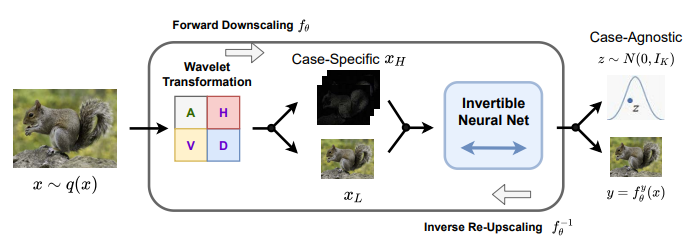
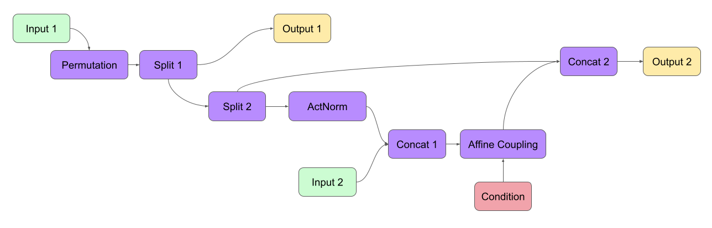

# FrEIA-Implementation

  

This is an extra example and tutorial about [FrEIA](https://github.com/VLL-HD/FrEIA) with rich description. If you are interested in **Invertible Neural Network** or **Flow-Model**,  hope this repo can help you to understand the framework and modules as well.

Feel free to contact me if you encounter any problems in the code.

## Graph-INN (refer to sequential.py)

  

## Documents

:link: https://vll-hd.github.io/FrEIA/_build/html/index.html

:link: [i-Resnet](https://arxiv.org/abs/1811.00995)

:link: [Glow](https://arxiv.org/abs/1807.03039)

:link: [NICE](https://arxiv.org/abs/1410.8516)

## Keywords
- Normalizing Flow
- Invertible Neural Networks
